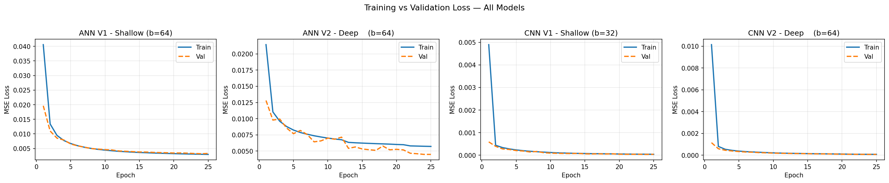

# AutoEncoder Experiments (PyTorch)

Hey! Welcome to my AutoEncoder project. I built this to get a hands-on understanding of how different neural network architectures compress and reconstruct images. I used PyTorch and the EMNIST dataset (which has both numbers and letters) to really test the limits of these models. 

I split my experiments into three main notebooks, starting from the basics and moving up to some pretty advanced stuff. Here is what I did:

## 1. Getting the Basics Down
**File:** `ANN&CNN AutoEncoders(2 Variants Each) by RISHI GARG.ipynb`

In this first notebook, my goal was to build the baselines and see the difference between "flat" networks and spatial networks.
* **What I tried:** I built a simple and a deep version of an ANN (using standard linear layers), and compared them to basic CNNs. 
* **The results:** Treating an image as a flat 784-item list (the ANN approach) made the reconstructed images look pretty blurry. The CNNs did a much better job of keeping the actual shapes of the characters intact, but they were still a bit rough around the edges.

## 2. Fixing the "Blur" with Skip Connections
**File:** `autoencoders-ann-vs-optimized-cnn-with-skip-conn.ipynb`

I noticed that squeezing the images through a tiny bottleneck made the models lose the sharp details. 
* **What I tried:** I upgraded my CNNs by adding **Skip Connections** (kind of like a ResNet). I basically took the output from the early layers and added it straight into the decoding layers. I also tried swapping out standard MaxPool layers for strided convolutions to see if the model could learn how to downsample better on its own.
* **The results:** Massive improvement. Because the decoder had access to those early high-res details, the reconstructed letters came out way crisper and sharper. 

## 3. The Final Showdown
**File:** `residual-cnn-deep-ann-autoencoders-on-emnist.ipynb`

For the final notebook, I took my best models from the first two notebooks and pitted them against each other on the harder EMNIST letters to see what works best.
* **What I tried:** I ran my deepest, most optimized ANN (packed with BatchNorm1d and Dropout to stop overfitting) against my top-tier Residual CNNs.
* **The results:** The Residual CNN with strided convolutions was the absolute winner. The ANN hit a wall on how well it could learn the complex shapes of letters, but the Residual CNN handled them easily and got the lowest validation loss by far. 

---

## 📊 Performance & Results

Here is the visual proof from the final showdown! As you can see, the deep CNN architecture learns beautiful spatial representations without overfitting.

**Training vs. Validation Loss** *(Showing convergence and model stability over epochs)* 

**Original vs. Reconstructed EMNIST Images** *(Using the best performing Deep CNN V2 - b=64)* .png)

---

## 🛠 Tech Stack
* **Framework:** PyTorch (for the models, loss calculations, and training loops)
* **Data:** `torchvision.datasets` (EMNIST)
* **Visuals:** Matplotlib (for checking the "Original vs. Reconstructed" images, plotting loss, and PCA scatter plots)
